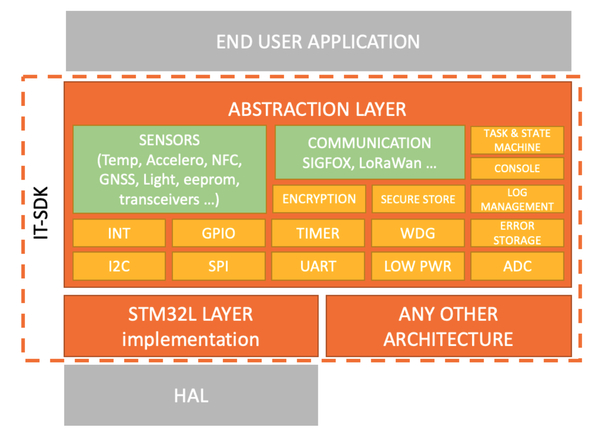

# Disk91 IoT_SDK not only for STM32

This project is a low level SDK with a harwdare abstraction layer designed to make IoT project. The purpose is to quickly be able to create communicating IoT device over LPWAN (LoRaWAn, Sigfox...) for fast prototyping but also being able to bring that firmware to production will all the necessary components avaoilable out-of-the-box. This SDK try to be fully configurable with header files. The objectif is to propose an abstraction layer between the software implementation and the MCU execution allowing to port the firmware on different plateform. 

 "IT-SDK Architecture"

The SDK is currently implementing STM32L architecture. The abstraction layer allows to quickly add new platforms. 

It implements different usefull function with (I hope) a cleaner code than the usual ST SDK components. 

Most is done to preserve code size, the SDK can target small flash MCU from 16KB for simple applications.

* IDE environement
  * open-source environment GCC / AC6 (Eclipse)
  * CubeIDE environment GCC / AC6 (Eclipse)
  * May work with any others

* Supported MCU functions
  * Low Power switch with regular auto-wakeup / LPUART / UART /GPIO Wake-up
  * RTC with calibration
  * EEprom for configuration backup
  * Watchdog 
  * Timers with calibration (hardware & software)
  * GPIO / SPI / I2C abstraction
  * Time update
  * Generic Interrupt Handler (hardware independant)

* Supported Advanced features
  * Task Scheduler
  * State Machine 
  * Multiple Serial console logger
  * Error logger with NVM storage
  * Secured debug & configuration Console
  * Secured Storage in EEPROM for keys
  * End 2 End Sigfox & LoRaWan encryption
  * Configuration over serial for ID commissionning during manufacturing process
  * Accelerometer abstraction layer
  
* Communication protocols interface
  * Sigfox ( clear-text, AES128-CTR, SPECK32, Sigfox-EAS128-CTR-Encryption )
  * LoRaWan ( LoRaWan-Encryption, EAS128-CTR, SPECK32 ) - join / uplink / downlink / ack

* Supported / tested platforms
  * STM32L011
  * STM32L053
  * STM32L072
  * MURATA CMWX1ZZABZ

* Supported drivers
  * eeprom
     * m95640
  * sigfox
     * s2lp (tested on RCZ1)
     * murata cmwx1zzabz (sx1276) (tested on RCZ1 & RCZ2)
  * lorawan
    * murata cmwx1zzabz (sx1276)
  * T / H / P
     * bosh bme280
  * Light
     * Maxim Max44009
  * Current / Battery Pack
    * Maxim Max17205 / Max17201
  * NFC
  	 * ST25DV - block access / serial console over FTM & memory
  * Hall Effect
     * sl353
  * Accelerometer
     * STM - LIS2DH12
       
* Supported stacks
  * lorawan
     * semtech stack
  * sigfox
     * sigfox stack

The second objective is to be able to port this SDK to different patform
to make it a portable SDK. The SDK have a it-sdk directory where everything needs to be portable. stm32l-sdk contains all the subfunctions specific to this platform.

# Start your project by configuring a skeleton with Cube Mx 

* Sys Clock Mux : HSI16
* Watchdog : configure IWDG with LSI 37KHz, IWDG_WINDOW value 4095, IWDG_PRESCALER value 256
* Rtc timer : TIM21 is enable with clock source internal for calibration
* LowPower : 
  * LPUART1/USART1/USART2 (Async 9600 - 8/N/1) for WakeUp => clock setting needs to be HSI and max speed needs to be 9600
  * RTC WakeUp => Activate ClkSource, Calendar, Internal WakeUp, Clk config : LSI, RTC/NVIC => Interrupt activated, Async prediv: 127, Sync prediv: 255
  * GPIO WakeUp => Activate the GPIO as ExtInterrupt, set with Pull & Trigger en Fall/Rise, activate NVIC EXI1_15
* adc : Select an adc like for temperature and Vcc to get the needed headers

When generating the Project
* Code generator:
  * select Generate peripheral initalization as par of .c/.h
  * Set all free pins as analog
* Advanced Settings:
  * Check Not Generated Function Call for ADC


# Import the SDK (this repository)

1. Clone this repository into the root of your project.
2. For the next configuration, you need to do it ifor both Debug *and* Release configuration 
3. Add in project properties >> C/C++ General >> Path&Symbol >> Source location >> the repository ItSdk Src directory.
4. Add in project properties >> C/C++ Build >> Settings >> Tool Settings >> MCU GCC Compiler >> Includes the ItSdk >> Inc directory.
5. In C/C++ Build / Settings / Build Step / pre-build steps you can add the command _touch "${workspace_loc:/${ProjName}/stm32-it-sdk/Src/it_sdk/console/console.c}"_ this will update the compile date on every build
6. Copy *ItSdk/Src/project_main.c.template* file into Core/Src/project_main.c and make the modification you want to get started. 

# Configure the SDK

1. Copy the *ItSdk/Inc/it_sdk/config.h.template* file into *Core/Inc/it_sdk/config.h*
2. Copy the *ItSdk/Inc/it_sdk/configDrivers.h.template* file into *Core/Inc/it_sdk/configDrivers.h* [needed when using some of the drivers]
3. Copy the *ItSdk/Inc/it_sdk/configSigfox.h.template* file into *Core/Inc/it_sdk/configSigfox.h* [needed when using sigfox drivers]
4. Copy the *ItSdk/Inc/it_sdk/configLoRaWan.h.template* file into *Core/Inc/it_sdk/configLoRaWan.h* [needed when using LoRaWAn drivers]
5. Edit these files and fill the different settings according to your environment and your choices.


# Modify the Cube Mx skeleton
Things to not forget once a cubeMx project has been created
* Gpio.c
   => remove the line with the default setting for GPIOs
  
* Main.c
   => includes
```C
  /* USER CODE BEGIN Includes */
	#include <it_sdk/config.h>
	#include <it_sdk/itsdk.h>
  /* USER CODE END Includes */
```  
   => main
```C
    MX_IWDG_Init();
  	/* USER CODE BEGIN 2 */
  	  itsdk_setup();
  	/* USER CODE END 2 */

  	/* Infinite loop */
  	/* USER CODE BEGIN WHILE */
  	while (1)
  	{
	  /* USER CODE END WHILE */
	  /* USER CODE BEGIN 3 */
	  itsdk_loop();
  	}
  	/* USER CODE END 3 */
```

  
Other modifications (need to be done on every CubeMx project regeneration):
  - GPIO - (in gpio.c) Cube Mx is setting/resetting the Gpio state on init. You need to manually comment the line in *gpio.c* to avoid the pin to be modified on MCU wake-up. The other solution is to let the gpio init as-is and add a function *void stm32l_lowPowerRestoreGpioConfig()* containing the gpio reconfiguration after wakeup.

  - ADC - if you choose to not use ADC_OPTIMIZED_CODE_FOR_SIZE : remove generated adc.c/h and remove adc references in main.c 
  
# Documentation

The documentation about the different components is available in **[/Docs](Docs/)** directory.
The function API are not documented in the _.h_ files but more generally in the _.c_ files.
Work in progress...

# Examples 

The examples are published on different Git repo to simplify the distribution of the SDK.
See **/Example** directory for a direct access to these ready to use projects.

# Version Upgrade
When upgrading the SDK from a new version, the main impact is to add the new Settings expected in the different
configuration file. Please find the different settings added version after version

## from version 1.6.0
### config.h
 - ITSDK_WITH_WDG / allows to disable the watchdog 
 - ITSDK_WITH_UART_RXIRQ / allows to enable an RX IRQ on Serial communications with internal circular buffer
 - ITSDK_WITH_UART_RXIRQ_BUFSZ / size of the RX IRQ circular buffer for each of the serial channel (power of two)
 - ITSDK_WITH_EXPERIMENTAL / activate or deactivate some experimental code by default set it to DISABLE

### configDriver.h
 - ITSDK_DRIVERS_ACCEL_LIS2DH12 

## from version 1.5.0
### config.h
- ITSDK_ADC_OPTIMIZE_SIZE
- ITSDK_ADC_OVERSAMPLING
- ITSDK_DEFAULT_REGION

### confgiDriver.h
- ITSDK_DRIVERS_SL353

### configLoRaWan.h
 - ITSDK_MURATA_TCXO_WARMUP
 - ITSDK_MURATA_WAKEUP_TIME
 - ITSDK_MURATA_ANTSW_RX_BANK (typo fixed)
 - ITSDK_MURATA_ANTSW_RX_PIN (typo fixed)
 - ITSDK_MURATA_ANTSW_TXBOOST_PIN (typo fixed)
 - ITSDK_MURATA_ANTSW_TXRFO_PIN (typo fixed)
 - header define name changed
 
### configSigfox.h
 - ITSDK_MURATA_ANTSW_RX_BANK (typo fixed)
 - ITSDK_MURATA_ANTSW_RX_PIN (typo fixed)
 - ITSDK_MURATA_ANTSW_TXBOOST_PIN (typo fixed)
 - ITSDK_MURATA_ANTSW_TXRFO_PIN (typo fixed)
 - ITSDK_SIGFOX_IF_TX_RCZ1
 - ITSDK_SIGFOX_IF_TX_RCZ3
 - ITSDK_SIGFOX_IF_TXRX_RCZ1
 - ITSDK_SIGFOX_IF_TXRX_RCZ3
 - ITSDK_MURATA_TCXO_WARMUP
 - ITSDK_SX1276_SFXWAKEUP_TIME
 - ITSDK_SIGFOX_MAXPOWER
 - ITDSK_SIGFOX_RCZ (removed)
 - ITSDK_MURATA_WAKEUP_TIME

# License 

This code and ItSdk are under GPLv3. You can use it freely, you can modify, redistribute but *you must* publish your source code. 

When included into a commercial product you have the following obligations:
- The commercial product must include as part of the documentation (Website + paper) and written on the packaging the following sentence  **build thanks to Disk91 IoT_SDK**  
- The commercial product documentation (Website + paper) a link to the Disk91 IoT_SDK github repository and a link with all the modified and added source code the product includes (following the GPLv3 licence)

Other licenses can be obtained by contacting me on [disk91.com](https://www.disk91.com). Non public licence allows you to be released from the previously described obligations.  
